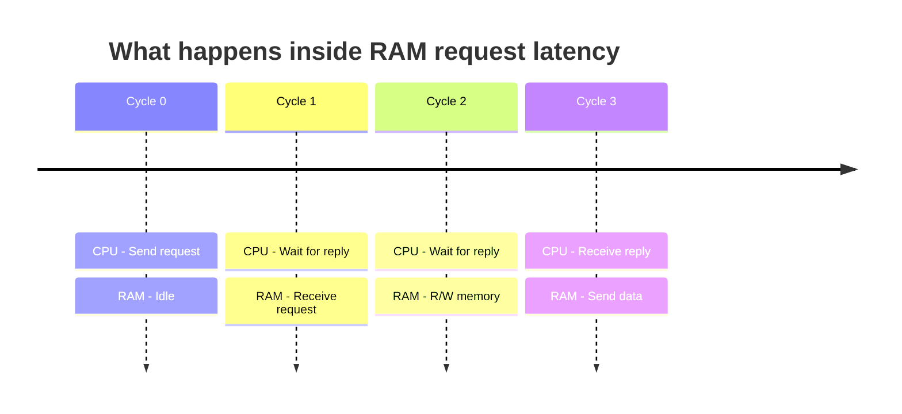

## Overall design

Memory: Total 8 MB, .text (instr) start at 0x0

RAM has 3-cycle latency, for:

```mermaid
timeline
  title What happens inside RAM request latency
    Cycle 0: CPU - Send request : RAM - Idle
    Cycle 1: CPU - Wait for reply : RAM - Receive request
    Cycle 2: CPU - Wait for reply : RAM - R/W memory
    Cycle 3: CPU - Receive reply : RAM - Send data
```